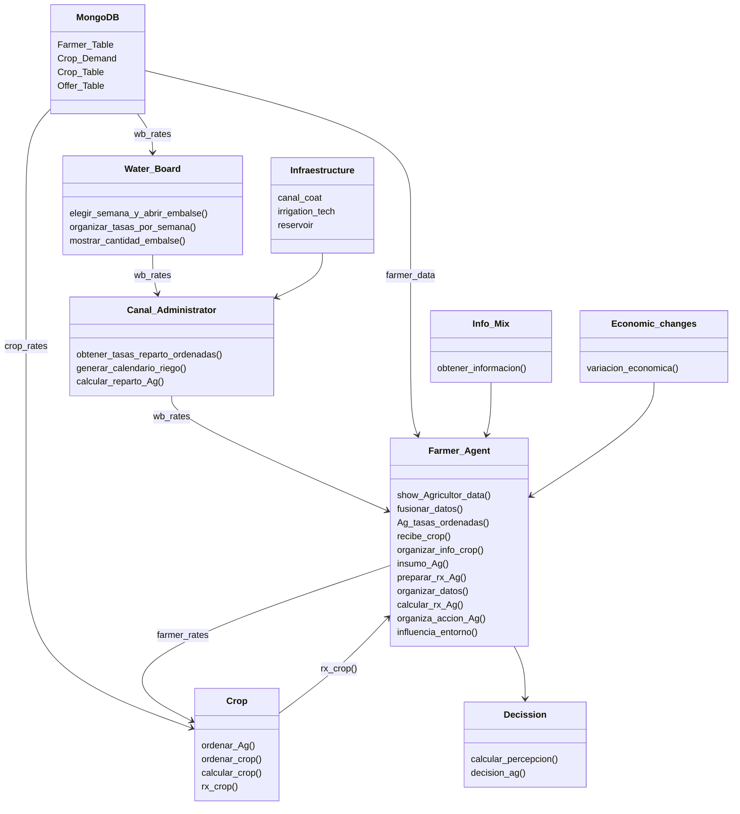

# **Agrotopia: Metodología para la Gestión Integrada de Recursos Hídricos de Cuencas**  

### **📄 Sobre este Repositorio**  
Este repositorio fue creado como parte de la investigación doctoral de **Pablo Velásquez Cisterna**, titulada **"Metodología para el Desarrollo de Escenarios Potenciales para la Gestión Integrada de Recursos Hídricos de Cuencas"**, llevada a cabo entre los años 2019 y 2024. La investigación fue supervisada por el **Dr. Mario Lillo Saavedra** en la **Universidad de Concepción**, dentro del **Programa de Doctorado en Recursos Hídricos para la Agricultura**.  

---

### **📚 Resumen de la Investigación**  

La investigación desarrolla una metodología para identificar y gestionar conflictos en la gestión de recursos hídricos a escala de cuenca, con un enfoque particular en la **cuenca del río Longaví**, en la región del Maule, Chile. Esta área enfrenta importantes desafíos debido a la fragmentación de la tierra y la variabilidad hídrica, agravados por el cambio climático.  

Para abordar estos problemas, el estudio integra la **Socio-Hidrología** con **Modelos Basados en Agentes (ABM)** (SHABM), permitiendo un análisis detallado de las interacciones entre los usuarios del agua bajo distintos escenarios ambientales y normativos.  

#### **Marco Tecnológico**  
La herramienta de simulación desarrollada utiliza **Python** y **MongoDB**, considerando variables como:  
- Uso del suelo  
- Demanda hídrica  
- Factores económicos  

Los datos recolectados mediante entrevistas, observaciones y encuestas alimentan los modelos de simulación, permitiendo analizar comportamientos de usuarios:  
- **Egoístas**  
- **Neutrales**  
- **Colaboradores**  

Estos comportamientos se evalúan en función de la disponibilidad de agua y los niveles de supervisión.  

#### **Principales Resultados**  

- **Patrones de Decisión:** Los resultados muestran cómo los patrones de toma de decisiones cambian según los niveles de supervisión y la disponibilidad de agua.  

- **Gestión Adaptativa:** Se proponen estrategias para la gestión adaptativa de recursos hídricos, promoviendo la sostenibilidad en zonas agrícolas afectadas por el cambio climático.  

#### **Direcciones para Investigaciones Futuras**  
El estudio sugiere:  

- Ampliar el análisis de datos sociales para comprender mejor los sistemas sociales complejos que influyen en la gestión hídrica.  
- Explorar enfoques interdisciplinarios que mejoren la precisión de las simulaciones socio-hidrológicas.  
- Desarrollar políticas y estrategias de gestión más efectivas basadas en resultados de simulación.  

---

### **🌍 Área de Estudio**  

#### **Área General**  
  

#### **Área Específica**  
  

---

### **📊 Datos**  
La información almacenada en la base de datos **MongoDB (AgroDB)** se encuentra en la carpeta `Data` del proyecto. Incluye las siguientes colecciones:  

- **Farmer_Table:** Información de los agricultores.  
- **Crop_Demand:** Demanda de agua de los cultivos.  
- **Crop_Table:** Detalles de los cultivos.  
- **Offer_Table:** Oferta de agua disponible.  

  

---

### **📦 Requisitos**  
- **Python 3.x**  
- **MongoDB**  
- **Conda**  

---

### **📥 Instalación de Paquetes**  

#### **Paso 1: Crear un entorno `conda`**  
```bash
conda create --name agrotopia_env python=3.9
conda activate agrotopia_env


## Contexto
La implementación de esta herramienta consta de dos partes principales recopilacion de la informacion de demanda diaria de los cultivos
la cuao esta en mm dia y es transformada a litros por segundos, se transforma a las a litros por segundo para ser ultilizada con lo referente a la oferta
de agua en litros por segundo. los datos restantes se obtienen de sgun lo corresponda a cada cultivo rendidmiento, valor de mercado y otros lo cual es almancenado
en la base de datos MongoDB llamada *AgroDB*
PRueba de texto
<details>
  <summary>Title 1</summary>
  <p>Some hidden content goes here</p>
  Here is some more without a paragraph tag
</details>
<details>
  <summary>Title 2</summary>
  <p>Same stuff here</p>
</details>

Area de Estudio,


Area especifica,


## Data
La informacion utilizada en la base de datos MongoDb (AgroDB) está en la carpeta Data del proyecto, es la necesaria para las cuatro colecciones en MongoDb, Farmer_Table, Crop_Demand, Crop_Table y Offer_Table.


## Requirements

## Package Instalation


```python
import pandas as pd
hola= pd.csv_read('Path\file', sep='')
```
## Use


## Agrotopia Diagram




## Results
La informacion utilizada en la base de datos MongoDb (AgroDB) está en la carpeta Data del proyecto, es la necesaria para las cuatro colecciones en MongoDb, Farmer_Table, Crop_Demand, Crop_Table y Offer_Table.


La informacion utilizada en la base de datos MongoDb (AgroDB) está en la carpeta Data del proyecto, es la necesaria para las cuatro colecciones en MongoDb, Farmer_Table, Crop_Demand, Crop_Table y Offer_Table.


