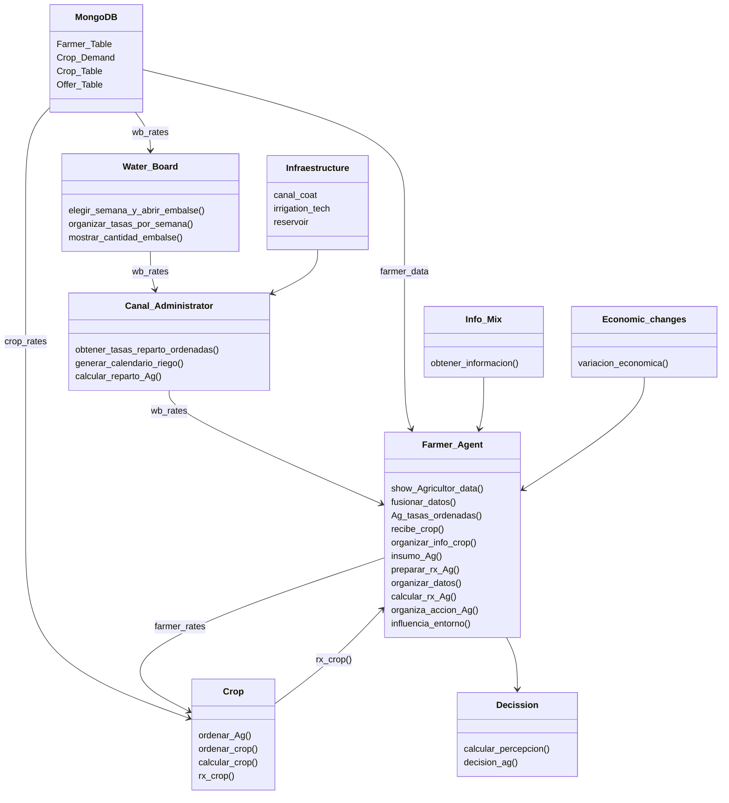

# 🌱 **Methodology for the Development of Potential Scenarios for Integrated Water Resources Management in River Basins**

### 📄 **About This Repository**
This repository was established as part of the doctoral research conducted by Pablo Velásquez Cisterna, entitled "Methodology for the Development of Potential Scenarios for Integrated Water Resource Management in River Basins," carried out between 2019 and 2024. The research was undertaken at the University of Concepción within the Doctoral Program in Water Resources and Energy for Agriculture.**.

---

### 📚 **Research Summary**

This study develops a methodological framework for identifying and managing conflicts in water resource management at the basin scale, with a particular focus on the Longaví River Basin in the Maule Region of Chile. This area faces significant challenges due to land fragmentation and hydrological variability, exacerbated by climate change. 

To address these issues, the research integrates **Socio-Hydrology** with **Agent-Based Modeling (ABM)** = (SHABM), enabling a detailed analysis of interactions among water users under varying environmental and regulatory scenarios.

#### **Technological Framework**
The simulation tool developed employs::
- **Python** and **MongoDB** as core technologies.
- **Key datasets** including:
  - Land use.
  - Crop-specific water demand.
  - Economic factors, encompassing market value analysis and crop resilience under drought          conditions.
  - Social reports on crop preferences based on water availability.
  - Geospatial data integration to model parcel dynamics within the basin.

Data collected through interviews, observations, and surveys inform the models, facilitating an analysis of behavioral patterns among water users, randomly classified as:

- **Self-interested agents** (prioritizing individual benefit).
- **Neutral agents** (making balanced decisions).
- **Collaborative agents** (acting for the collective good).

---

### 📈 **Key Findings and Publications**

#### **Research Outcomes**
- **Decision-Making Patterns**: Results reveal significant disparities in agent behavior. Self-interested agents tend to disregard regulations under low supervision, whereas collaborative agents consistently adhere to rules, even under water stress.

- **Adaptive Management**: Implementing high supervision levels (90%) substantially reduces conflicts, identifying critical areas requiring prioritized intervention.

- **Conflict Identification**: The analysis pinpoints high-risk conflict zones under scenarios of low water availability.

#### **Scientific Publications**
1. **Article 1:**  
   - **Title:** *Socio-Hydrological Agent-Based Modeling as a Framework for Analyzing Conflicts Within Water User Organizations*  
   - **DOI:** [https://doi.org/10.3390/w16223321]  
   - **Abstract:** This article presents the development of a socio-hydrological agent-based model (SHABM) applied to the Longaví River Basin, assessing how supervision and water availability influence behavioral patterns and conflicts in agricultural systems. 

2. **Article 2:**  
   - **Title:** *Dataset for Reproducible Interaction in a Socio-Hydrological Model with ABM*  
   - **DOI:** Publication in progress, link pending.  
   - **Abstract:** This work introduces a structured and documented dataset for analyzing reproducible socio-hydrological interactions, evaluating water management strategies and their impact on user behavior.


### 📊 **Core Model Components**
#### **1. MongoDB Database (AgroDB)**
Structure:
- **Farmer_Table:** Basic farmer information.
- **Crop_Demand:** Water demand per crop.
- **Crop_Table:** Technical and economic crop details. 
- **Offer_Table:** Weekly water availability.

#### **2. Geospatial Integration**
Geographic data (shapefiles) are utilized to model irrigation schedules and parcel distribution.

---


### **🌍 Study Area**  

#### **General Area: **  
  

#### **Specific Area: **  
  

---

### **📊 Data**  
The data stored in the **MongoDB database (AgroDB)** is located in the project's `Data` directory, containing the following collections:

- **Farmer_Table:** Farmer information  
- **Crop_Demand:** Crop water requirements 
- **Crop_Table:**  Agricultural crop details  
- **Offer_Table:** Water supply availability

  

---


---

### **📦 Requirements**  
- **Python 3.x**  
- **MongoDB**  
- **Conda**  

---

## Agrotopia Diagram




# 🚀 **Ejecución del Programa**

### ✍️ **Notas del Autor**
El proyecto tiene dos versiones:
  - Español (SP)
  - Inglés (ENG).

crear el ambiente donde dejar el programa
   ```bash
   conda create --name agrotopia_env python=3.9
   conda activate agrotopia_env

```


```python
   streamlit run interfaz.py
```
Se ejecuta un servidor web local con las opciones para generar los dataset


## **📁 Tratamiento de Archivos CSV**  

🔄 **Procesamiento de datos**  
El proyecto utiliza archivos CSV para almacenar y procesar información como demanda hídrica, datos económicos y detalles de cultivos.  

### Ejemplo: Filtrado de datos  
```python
import pandas as pd

# Leer archivo CSV
data = pd.read_csv("data/cultivos.csv")

# Filtrar por año y cultivo
filtro = data[(data["Año"] == 2020) & (data["Cultivo"] == "Maíz")]

# Guardar resultados filtrados
filtro.to_csv("output/filtered_data.csv", index=False)

print("Filtrado completado. Archivo guardado en 'output/filtered_data.csv'")
```
## Results
La informacion utilizada en la base de datos MongoDb (AgroDB) está en la carpeta Data del proyecto, es la necesaria para las cuatro colecciones en MongoDb, Farmer_Table, Crop_Demand, Crop_Table y Offer_Table.


La informacion utilizada en la base de datos MongoDb (AgroDB) está en la carpeta Data del proyecto, es la necesaria para las cuatro colecciones en MongoDb, Farmer_Table, Crop_Demand, Crop_Table y Offer_Table.


### 📊 **Visualizacións**
Los gráficos generados muestran tendencias claras:  
- 📈 Incrementos en la eficiencia hídrica.
- 🔍 Análisis detallados de los conflictos entre agentes.
