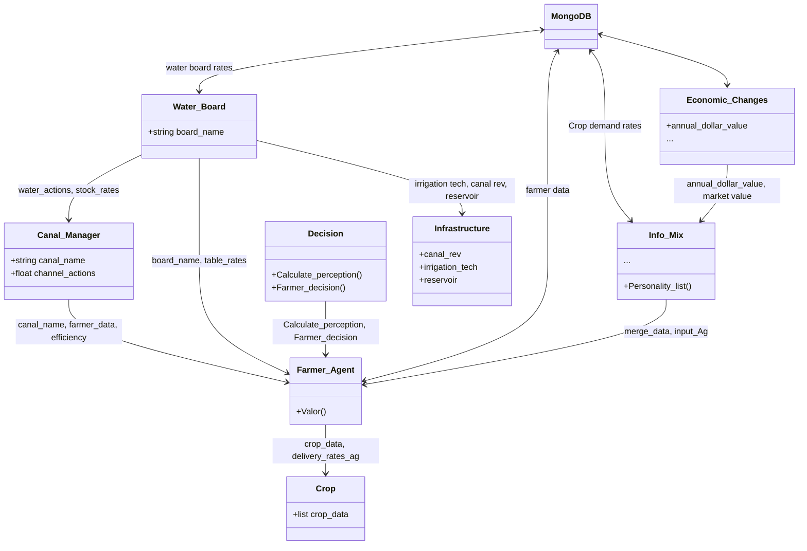

# Agrotopia - (PhD Thesis)
## About this Repository
Este repositorio fue realizada en el marco de la investigacion doctoral de Pablo Velásquez Cisterna, Methodology for the Development of Potential Scenarios for the Integrated Management of Watershed Water Resources durante los años 2019-2024. La cual fue supervisada por el Dr. Mario Lillo Saavedra

En Universwidad de concepcion, programa de 
## Abstract


## Contexto
PRueba de texto
<details>
  <summary>Title 1</summary>
  <p>Some hidden content goes here</p>
  Here is some more without a paragraph tag
</details>
<details>
  <summary>Title 2</summary>
  <p>Same stuff here</p>
</details>

## Data


## Requirements

## Package Instalation


```python
import pandas as pd
hola= pd.csv_read('Path\file', sep='')
```
## Use


## Flow Diagram



 ```  mermaid
gantt
    title Carta Gantt del Proyecto de Gestión de Riego
    dateFormat  YYYY-MM-DD
    section Planificación
    Definir requisitos       :a1, 2024-01-01, 2024-01-15
    Diseño del sistema       :a2, after a1, 2w
    section Desarrollo
    Implementar Water_Board  :b1, 2024-02-01, 1m
    Implementar Canal_Manager:b2, after b1, 1m
    Implementar Farmer_Agent :b3, after b2, 1m
    Implementar Crop         :b4, after b3, 2w
    Implementar Decision     :b5, after b4, 2w
    Implementar Info_Mix     :b6, after b5, 2w
    Implementar Economic_Changes :b7, after b6, 2w
    section Pruebas
    Pruebas unitarias        :c1, after b7, 3w
    Pruebas de integración   :c2, after c1, 2w
    Pruebas del sistema      :c3, after c2, 2w
    section Despliegue
    Despliegue en producción :d1, 2024-07-01, 1w
    Verificación final       :d2, after d1, 1w

```


## Results

