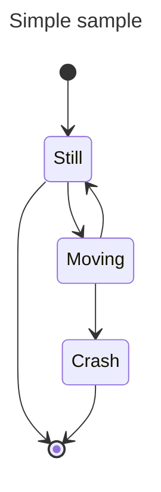

# Agrotopia - Phd Thesis
## About this Repository
Este repositorio de Tesis doctoral fue realizada en el marco de la investigacion doctoral de Pablo Velasquez Cisterna, durante los años 2019-2024. La cual fue supervisada por el dr. Mario Lillo Saavedra
## Abstract


## Contexto
PRueba de texto
<details>
  <summary>Title 1</summary>
  <p>Some hidden content goes here</p>
  Here is some more without a paragraph tag
</details>
<details>
  <summary>Title 2</summary>
  <p>Same stuff here</p>
</details>

## Data

## Requirements

## Package Instalation


```python
import pandas as pd
hola= pd.csv_read('Path\file', sep='')
```
## Use

### Results



