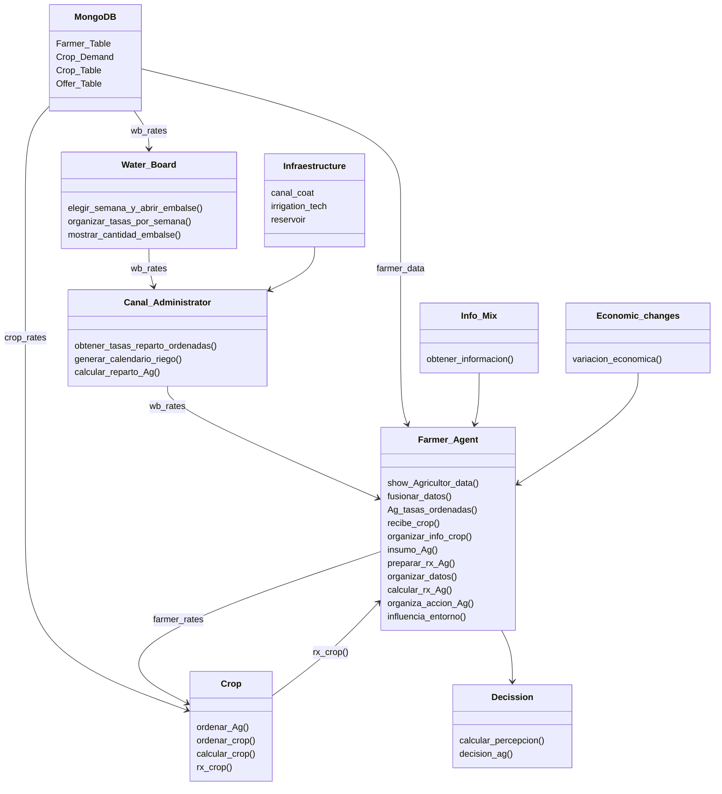

#  🌱 Agrotopia: Metodología para la Gestión Integrada de Recursos Hídricos de Cuencas**  

### **📄 Sobre este Repositorio**  
Este repositorio fue creado como parte de la investigación doctoral de **Pablo Velásquez Cisterna**, titulada **"Metodología para el Desarrollo de Escenarios Potenciales para la Gestión Integrada de Recursos Hídricos de Cuencas"**, llevada a cabo entre los años 2019 y 2024. La investigación fue supervisada por el **Dr. Mario Lillo Saavedra** en la **Universidad de Concepción**, dentro del **Programa de Doctorado en Recursos Hídricos para la Agricultura**.  

---

### **📚 Resumen de la Investigación**  

La investigación desarrolla una metodología para identificar y gestionar conflictos en la gestión de recursos hídricos a escala de cuenca, con un enfoque particular en la **cuenca del río Longaví**, en la región del Maule, Chile. Esta área enfrenta importantes desafíos debido a la fragmentación de la tierra y la variabilidad hídrica, agravados por el cambio climático.  

Para abordar estos problemas, el estudio integra la **Socio-Hidrología** con **Modelos Basados en Agentes (ABM)** (SHABM), permitiendo un análisis detallado de las interacciones entre los usuarios del agua bajo distintos escenarios ambientales y normativos.  

#### **Marco Tecnológico**  
La herramienta de simulación desarrollada utiliza **Python** y **MongoDB**, considerando variables como:  
- Uso del suelo  
- Demanda hídrica  
- Factores económicos
- Informe Social sobre preferencias de cultivo en función del valor del mercado del producto y resistencia a la sequía.  

Los datos recolectados mediante entrevistas, observaciones y encuestas alimentan los modelos de simulación, permitiendo analizar comportamientos de usuarios **egoístas**, **neutrales** y **colaboradores**, según la disponibilidad de agua y los niveles de supervisión.  

---

### **📈 Resultados y Publicaciones**  

#### **Resultados Clave de la Investigación**  
- **Patrones de Decisión:** Los resultados demuestran cómo las decisiones de los agentes, clasificados como egoístas, neutrales y cooperativos, varían en función de los niveles de supervisión y disponibilidad de agua. Los agentes egoístas son más propensos a ignorar los turnos de riego bajo condiciones de escasez y baja supervisión, mientras que los agentes cooperativos respetan consistentemente las reglas.  
- **Gestión Adaptativa:** Se observó que altos niveles de supervisión (90%) reducen significativamente los conflictos, mientras que escenarios de escasez de agua aumentan los comportamientos no cooperativos. Las áreas de alto riesgo de conflicto pueden identificarse y gestionarse de manera proactiva.  

#### **Publicaciones Científicas**  

- **Artículo 1:**  
  - **Título:** *Socio-Hydrological Agent-Based Modeling as a Framework for Analyzing Conflicts Within Water User Organizations*  
  - **DOI:** [https://doi.org/10.3390/w16223321](https://doi.org/10.3390/w16223321)  
  - **Resumen:** Este artículo describe el desarrollo de un modelo socio-hidrológico basado en agentes (SHABM) para analizar y gestionar conflictos en organizaciones de usuarios del agua en la cuenca del río Longaví, Chile. Los resultados muestran cómo la supervisión y la disponibilidad de agua afectan los patrones de comportamiento y las dinámicas de conflicto en sistemas hídricos agrícolas.  

- **Artículo 2:**  
  - **Título:** *Dataset for Reproducible Interaction in a Socio-Hydrological Model with ABM*  
  - **DOI:** Publicación en progreso, enlace pendiente.  
  - **Resumen:** Este trabajo introduce un conjunto de datos estandarizados y bien documentados para el análisis reproducible de interacciones socio-hidrológicas utilizando modelos basados en agentes (ABM). El conjunto de datos permite explorar dinámicas complejas y evaluar estrategias de gestión hídrica en sistemas agrícolas.  

---


### **🌍 Área de Estudio**  

#### **Área General cambiar el mapa**  
  

#### **Área Específica**  
  

---

### **📊 Datos**  
La información almacenada en la base de datos **MongoDB (AgroDB)** se encuentra en la carpeta `Data` del proyecto. Incluye las siguientes colecciones:  

- **Farmer_Table:** Información de los agricultores.  
- **Crop_Demand:** Demanda de agua de los cultivos.  
- **Crop_Table:** Detalles de los cultivos.  
- **Offer_Table:** Oferta de agua disponible.  

  

---


---

### **📦 Requisitos**  
- **Python 3.x**  
- **MongoDB**  
- **Conda**  

---

### **📥 Instalación de Paquetes**  


```python
import pandas as pd
hola= pd.csv_read('Path\file', sep='')
```
## Use


## Agrotopia Diagram



## **📁 Tratamiento de Archivos CSV**  

🔄 **Procesamiento de datos**  
El proyecto utiliza archivos CSV para almacenar y procesar información como demanda hídrica, datos económicos y detalles de cultivos.  

### Ejemplo: Filtrado de datos  
```python
import pandas as pd

# Leer archivo CSV
data = pd.read_csv("data/cultivos.csv")

# Filtrar por año y cultivo
filtro = data[(data["Año"] == 2020) & (data["Cultivo"] == "Maíz")]

# Guardar resultados filtrados
filtro.to_csv("output/filtered_data.csv", index=False)

print("Filtrado completado. Archivo guardado en 'output/filtered_data.csv'")

## Results
La informacion utilizada en la base de datos MongoDb (AgroDB) está en la carpeta Data del proyecto, es la necesaria para las cuatro colecciones en MongoDb, Farmer_Table, Crop_Demand, Crop_Table y Offer_Table.


La informacion utilizada en la base de datos MongoDb (AgroDB) está en la carpeta Data del proyecto, es la necesaria para las cuatro colecciones en MongoDb, Farmer_Table, Crop_Demand, Crop_Table y Offer_Table.


