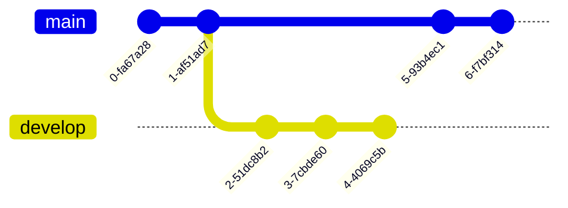
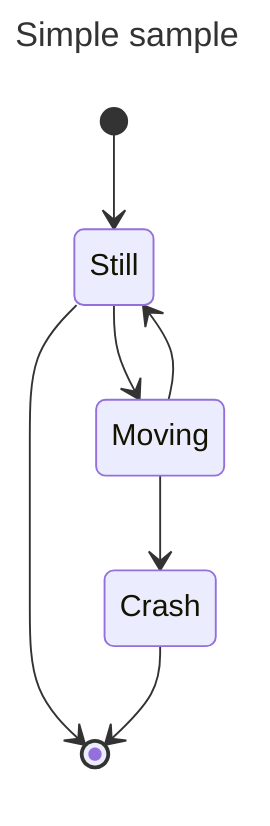

# Agrotopia - Phd Thesis
ABM for Agriculture

## asas

<details>
  <summary>Title 1</summary>
  <p>Some hidden content goes here</p>
  Here is some more without a paragraph tag
</details>
<details>
  <summary>Title 2</summary>
  <p>Same stuff here</p>
</details>

## Contexto
PRueba de texto
## Package Instalation


```python
import pandas as pd
hola= pd.csv_read('Path\file', sep='')
```
## Use

### Results




