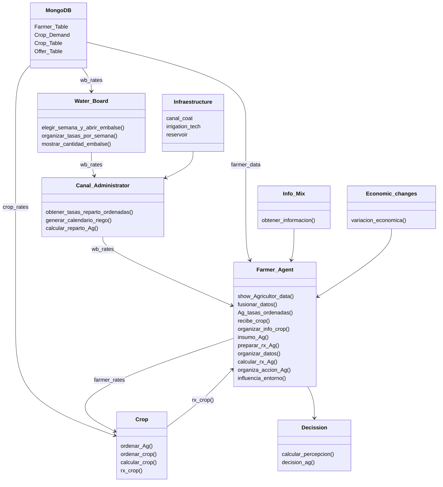

# Agrotopia - (PhD Thesis)
## About this Repository
Este repositorio fue realizado en el marco de la investigacion doctoral de Pablo Velásquez Cisterna, Methodology for the Development of Potential Scenarios for the Integrated Management of Watershed Water Resources durante los años 2019-2024. La cual fue supervisada por el Dr. Mario Lillo Saavedra

En Universidad de Concepción, programa de Doctorado Recursos hidricos para la agricultura
## Abstract


## Contexto
La implementación de esta herramienta consta de dos partes principales recopilacion de la informacion de demanda diaria de los cultivos
la cuao esta en mm dia y es transformada a litros por segundos, se transforma a las a litros por segundo para ser ultilizada con lo referente a la oferta
de agua en litros por segundo. los datos restantes se obtienen de sgun lo corresponda a cada cultivo rendidmiento, valor de mercado y otros lo cual es almancenado
en la base de datos MongoDB llamada *AgroDB*
PRueba de texto
<details>
  <summary>Title 1</summary>
  <p>Some hidden content goes here</p>
  Here is some more without a paragraph tag
</details>
<details>
  <summary>Title 2</summary>
  <p>Same stuff here</p>
</details>

Area de Estudio,


Area especifica,


## Data
La informacion utilizada en la base de datos MongoDb (AgroDB) está en la carpeta Data del proyecto, es la necesaria para las cuatro colecciones en MongoDb, Farmer_Table, Crop_Demand, Crop_Table y Offer_Table.


## Requirements

## Package Instalation


```python
import pandas as pd
hola= pd.csv_read('Path\file', sep='')
```
## Use


## Agrotopia Diagram




## Results
La informacion utilizada en la base de datos MongoDb (AgroDB) está en la carpeta Data del proyecto, es la necesaria para las cuatro colecciones en MongoDb, Farmer_Table, Crop_Demand, Crop_Table y Offer_Table.


La informacion utilizada en la base de datos MongoDb (AgroDB) está en la carpeta Data del proyecto, es la necesaria para las cuatro colecciones en MongoDb, Farmer_Table, Crop_Demand, Crop_Table y Offer_Table.


