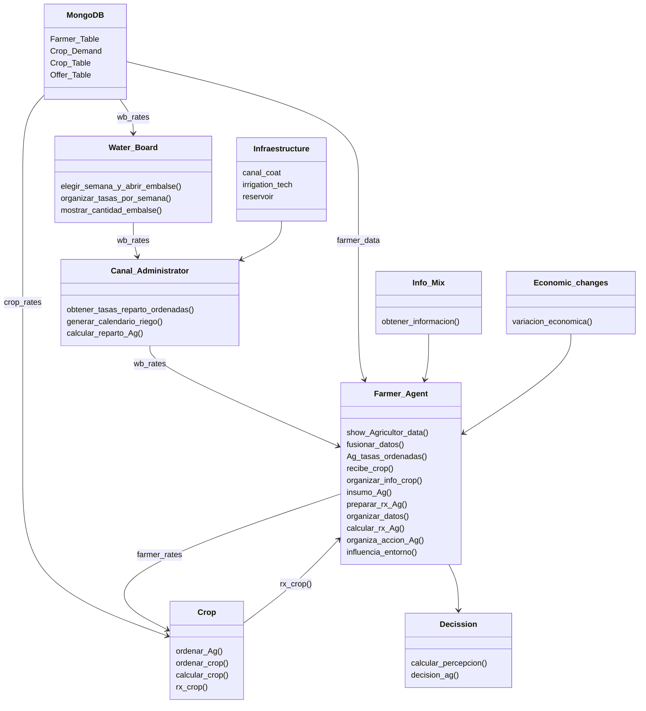

# 🌱 **Metodología para el Desarrollo de Escenarios Potenciales para la Gestión Integrada de Recursos Hídricos de Cuencas**

### 📄 **About This Repository**
This repository was established as part of the doctoral research conducted by Pablo Velásquez Cisterna, entitled "Methodology for the Development of Potential Scenarios for Integrated Water Resource Management in River Basins," carried out between 2019 and 2024. The research was undertaken at the University of Concepción within the Doctoral Program in Water Resources and Energy for Agriculture.**.

---

### 📚 **Research Summary**

This study develops a methodological framework for identifying and managing conflicts in water resource management at the basin scale, with a particular focus on the Longaví River Basin in the Maule Region of Chile. This area faces significant challenges due to land fragmentation and hydrological variability, exacerbated by climate change. 

To address these issues, the research integrates **Socio-Hydrology** with **Agent-Based Modeling (ABM)** = (SHABM), enabling a detailed analysis of interactions among water users under varying environmental and regulatory scenarios.

#### **Technological Framework**
The simulation tool developed employs::
- **Python** and **MongoDB** as core technologies.
- **Key datasets** including:
  - Land use.
  - Crop-specific water demand.
  - Economic factors, encompassing market value analysis and crop resilience under drought          conditions.
  - Social reports on crop preferences based on water availability.
  - Geospatial data integration to model parcel dynamics within the basin.

Data collected through interviews, observations, and surveys inform the models, facilitating an analysis of behavioral patterns among water users, randomly classified as:

- **Self-interested agents** (prioritizing individual benefit).
- **Neutral agents** (making balanced decisions).
- **Collaborative agents** (acting for the collective good).

---

### 📈 **Key Findings and Publications**

#### **Research Outcomes**
- **Patrones de Decisión:** Los resultados revelan diferencias significativas en las decisiones de los agentes. Los agentes egoístas tienden a ignorar las reglas bajo condiciones de baja supervisión, mientras que los agentes colaboradores respetan las reglas consistentemente, incluso bajo estrés hídrico.
- **Gestión Adaptativa:** La implementación de niveles de supervisión altos (90%) reduce considerablemente los conflictos, identificando áreas críticas que requieren atención prioritaria.
- **Identificación de Conflictos:** Los análisis permiten identificar zonas de alto riesgo de conflicto en escenarios de baja disponibilidad hídrica.

#### **Publicaciones Científicas**
1. **Artículo 1:**  
   - **Título:** *Socio-Hydrological Agent-Based Modeling as a Framework for Analyzing Conflicts Within Water User Organizations*  
   - **DOI:** [https://doi.org/10.3390/w16223321](https://doi.org/10.3390/w16223321)  
   - **Resumen:** Este artículo describe el desarrollo de un modelo socio-hidrológico basado en agentes (SHABM) aplicado a la cuenca del río Longaví, evaluando cómo la supervisión y disponibilidad de agua afectan los patrones de comportamiento y los conflictos en sistemas agrícolas.  

2. **Artículo 2:**  
   - **Título:** *Dataset for Reproducible Interaction in a Socio-Hydrological Model with ABM*  
   - **DOI:** Publicación en progreso, enlace pendiente.  
   - **Resumen:** Este trabajo introduce un conjunto de datos estructurados y documentados para analizar interacciones socio-hidrológicas reproducibles, evaluando estrategias de manejo hídrico y su impacto en el comportamiento de los usuarios.


### 📊 **Componentes Clave del Modelo**
#### **1. Datos en MongoDB (AgroDB)**
Estructura:
- **Farmer_Table:** Información básica de agricultores.  
- **Crop_Demand:** Demanda hídrica por cultivo.  
- **Crop_Table:** Detalles técnicos y económicos de cultivos.  
- **Offer_Table:** Disponibilidad semanal de agua.  

#### **2. Integración Geoespacial**
Se utiliza información geográfica (shapefiles) para modelar turnos de riego y la distribución de parcelas.

---


### **🌍 Área de Estudio**  

#### **Área General cambiar el mapa**  
  

#### **Área Específica**  
  

---

### **📊 Datos**  
La información almacenada en la base de datos **MongoDB (AgroDB)** se encuentra en la carpeta `Data` del proyecto. Incluye las siguientes colecciones:  

- **Farmer_Table:** Información de los agricultores.  
- **Crop_Demand:** Demanda de agua de los cultivos.  
- **Crop_Table:** Detalles de los cultivos.  
- **Offer_Table:** Oferta de agua disponible.  

  

---


---

### **📦 Requisitos**  
- **Python 3.x**  
- **MongoDB**  
- **Conda**  

---

## Agrotopia Diagram




# 🚀 **Ejecución del Programa**

### ✍️ **Notas del Autor**
El proyecto tiene dos versiones:
  - Español (SP)
  - Inglés (ENG).

crear el ambiente donde dejar el programa
   ```bash
   conda create --name agrotopia_env python=3.9
   conda activate agrotopia_env

```


```python
   streamlit run interfaz.py
```
Se ejecuta un servidor web local con las opciones para generar los dataset


## **📁 Tratamiento de Archivos CSV**  

🔄 **Procesamiento de datos**  
El proyecto utiliza archivos CSV para almacenar y procesar información como demanda hídrica, datos económicos y detalles de cultivos.  

### Ejemplo: Filtrado de datos  
```python
import pandas as pd

# Leer archivo CSV
data = pd.read_csv("data/cultivos.csv")

# Filtrar por año y cultivo
filtro = data[(data["Año"] == 2020) & (data["Cultivo"] == "Maíz")]

# Guardar resultados filtrados
filtro.to_csv("output/filtered_data.csv", index=False)

print("Filtrado completado. Archivo guardado en 'output/filtered_data.csv'")
```
## Results
La informacion utilizada en la base de datos MongoDb (AgroDB) está en la carpeta Data del proyecto, es la necesaria para las cuatro colecciones en MongoDb, Farmer_Table, Crop_Demand, Crop_Table y Offer_Table.


La informacion utilizada en la base de datos MongoDb (AgroDB) está en la carpeta Data del proyecto, es la necesaria para las cuatro colecciones en MongoDb, Farmer_Table, Crop_Demand, Crop_Table y Offer_Table.


### 📊 **Visualizacións**
Los gráficos generados muestran tendencias claras:  
- 📈 Incrementos en la eficiencia hídrica.
- 🔍 Análisis detallados de los conflictos entre agentes.
