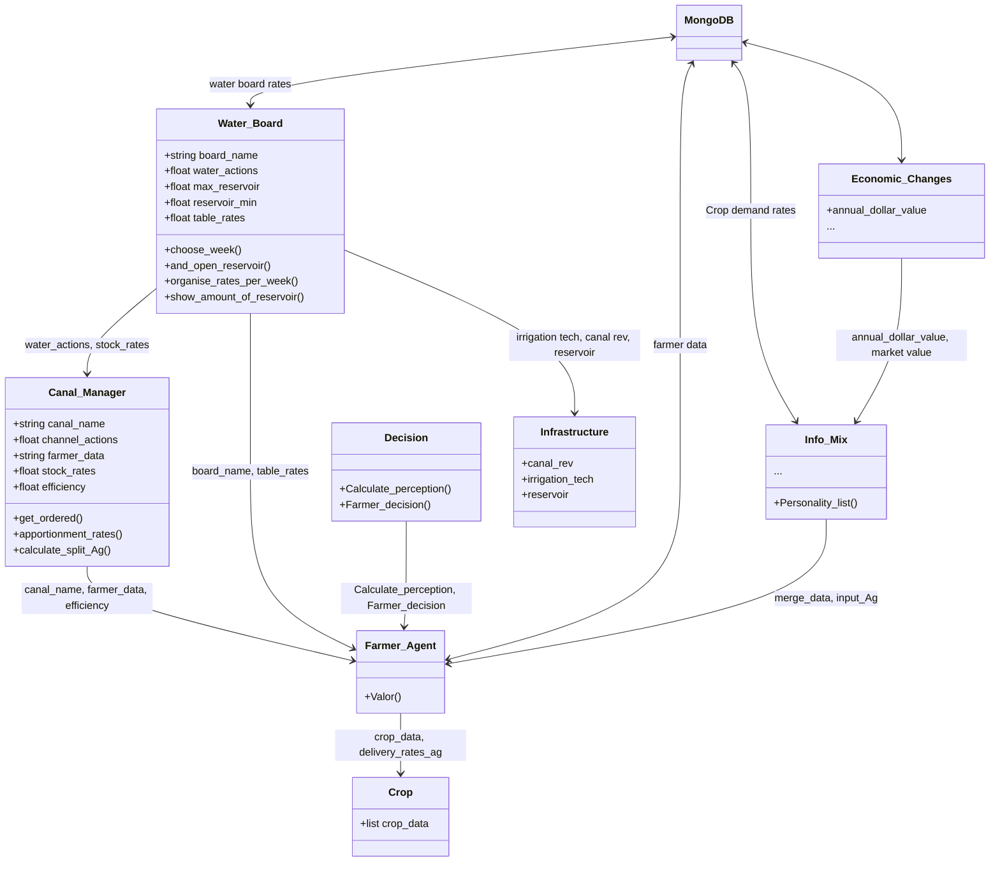

# Agrotopia - (PhD Thesis)
## About this Repository
Este repositorio fue realizada en el marco de la investigacion doctoral de Pablo Velásquez Cisterna, Methodology for the Development of Potential Scenarios for the Integrated Management of Watershed Water Resources durante los años 2019-2024. La cual fue supervisada por el Dr. Mario Lillo Saavedra

En Universwidad de concepcion, programa de 
## Abstract


## Contexto
PRueba de texto
<details>
  <summary>Title 1</summary>
  <p>Some hidden content goes here</p>
  Here is some more without a paragraph tag
</details>
<details>
  <summary>Title 2</summary>
  <p>Same stuff here</p>
</details>

## Data


## Requirements

## Package Instalation


```python
import pandas as pd
hola= pd.csv_read('Path\file', sep='')
```
## Use


### Flow Diagram


### Results
